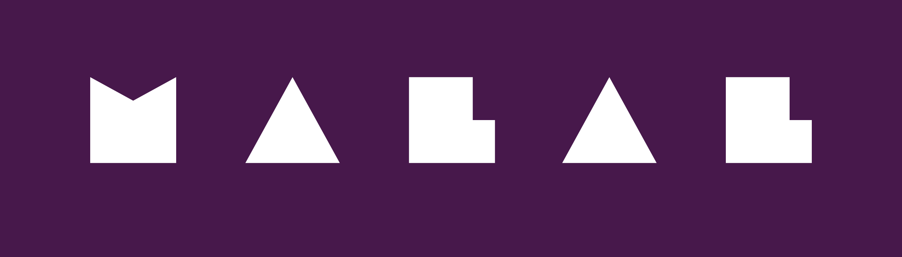

<p align="center"></p>

# malal
a light weight i18n library for node.js and the browser
[](https://coveralls.io/github/mouafa/malal?branch=master)

## Installation
```console
$ yarn add malal
```

If you prefer using npm:

```console
$ npm i -S malal
```

## Usage

```js
const m = require('malal')
// decalre your translation mapping or parse a json file
const en = { greeting : { _hello : 'hello {{name}}' }}
const de = { greeting : { _hello : 'hallo {{name}}' }}
m.set('en', en)
m.set('de', de)
```

by default the first language is used
> .__ is an alias of .tanslate

```js
m.__('greeting._hello') // >> 'hello {{name}}'
m.translate('greeting._hello') // >> 'hello {{name}}'
```

change the language
```js
m.use('de') // >> 'hello {{name}}'
m.__('greeting._hello') // >> 'hallo {{name}}'
```
set default context

```js
m.context = { name: 'Adam'}
m.__('greeting._hello') // >> 'hallo Adam'
```

set in place context
```js
m.context = { name: 'Adam'}
m.__('greeting._hello', { name: 'Sami'}) // >> 'hallo Sami'
```

composable use
```js
 m.set('en', en)
  .set('de', de)
  .use('de')
  .setContext({ name: 'Adam'})
  .__('greeting._hello', { name: 'Sami'}) // >> 'hallo Sami'
```
